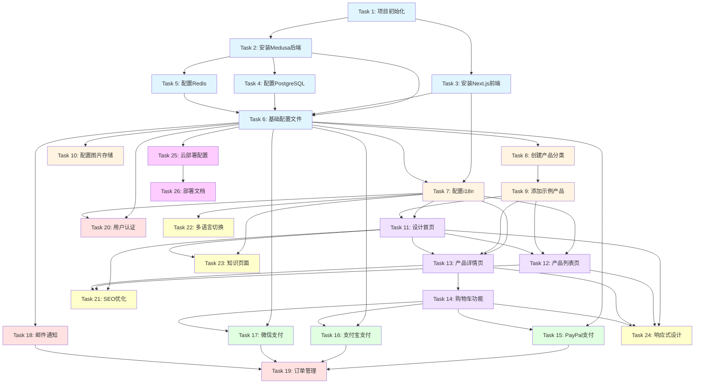

# 星禧水晶 - 跨境电商独立站项目规划

## 项目概述

**项目名称**: 星禧水晶 (Xingxi Crystal)  
**项目类型**: 跨境电商独立站  
**主营产品**: 周易五行水晶手串  
**技术栈**: Medusa + Next.js + PostgreSQL + Redis  
**支付方式**: PayPal + 支付宝 + 微信支付  
**语言支持**: 中文 + 英文  
**部署目标**: 云部署

---

## 任务分解（每个任务 ≤ 5分钟）

### 阶段一：环境搭建 (Tasks 1-6)

#### Task 1: 项目初始化和环境配置
- **耗时**: 3分钟
- **描述**: 创建项目根目录，初始化Git仓库
- **依赖**: 无
- **输出**: 项目文件夹结构，Git仓库

#### Task 2: 安装Medusa后端服务
- **耗时**: 5分钟
- **描述**: 使用`npx create-medusa-app`创建后端项目
- **依赖**: Task 1
- **输出**: Medusa后端项目结构

#### Task 3: 安装Next.js前端项目
- **耗时**: 4分钟
- **描述**: 使用Medusa starter模板创建Next.js前端
- **依赖**: Task 1
- **输出**: Next.js前端项目结构

#### Task 4: 配置PostgreSQL数据库
- **耗时**: 5分钟
- **描述**: 安装PostgreSQL，创建数据库，配置连接
- **依赖**: Task 2
- **输出**: 数据库连接配置文件

#### Task 5: 配置Redis缓存服务
- **耗时**: 4分钟
- **描述**: 安装Redis，配置Medusa连接
- **依赖**: Task 2
- **输出**: Redis配置文件

#### Task 6: 设置项目基础配置文件
- **耗时**: 5分钟
- **描述**: 配置环境变量、CORS、区域设置
- **依赖**: Task 2, Task 3, Task 4, Task 5
- **输出**: `.env`文件，`medusa-config.js`

---

### 阶段二：国际化和数据结构 (Tasks 7-10)

#### Task 7: 配置中英文国际化(i18n)基础
- **耗时**: 5分钟
- **描述**: 安装i18n库，创建语言文件结构
- **依赖**: Task 3, Task 6
- **输出**: i18n配置，中英文语言文件模板

#### Task 8: 创建产品分类结构（五行分类）
- **耗时**: 4分钟
- **描述**: 在Medusa后台创建五行分类（金木水火土）
- **依赖**: Task 6
- **输出**: 产品分类数据

#### Task 9: 添加示例产品数据（水晶手串）
- **耗时**: 5分钟
- **描述**: 创建3-5个示例水晶手串产品
- **依赖**: Task 8
- **输出**: 示例产品数据

#### Task 10: 配置产品图片存储
- **耗时**: 5分钟
- **描述**: 配置本地或云存储（如MinIO/S3）
- **依赖**: Task 6
- **输出**: 图片存储配置

---

### 阶段三：前端页面开发 (Tasks 11-14)

#### Task 11: 设计首页布局和组件
- **耗时**: 5分钟
- **描述**: 创建首页Hero区、特色产品展示组件
- **依赖**: Task 7, Task 9
- **输出**: 首页组件文件

#### Task 12: 创建产品列表页面
- **耗时**: 5分钟
- **描述**: 实现产品网格展示、筛选功能
- **依赖**: Task 7, Task 9, Task 11
- **输出**: 产品列表页面

#### Task 13: 创建产品详情页面
- **耗时**: 5分钟
- **描述**: 实现产品详情展示、规格选择
- **依赖**: Task 7, Task 9, Task 11
- **输出**: 产品详情页面

#### Task 14: 实现购物车功能
- **耗时**: 5分钟
- **描述**: 集成Medusa购物车API，创建购物车UI
- **依赖**: Task 13
- **输出**: 购物车页面和功能

---

### 阶段四：支付集成 (Tasks 15-17)

#### Task 15: 集成PayPal支付
- **耗时**: 5分钟
- **描述**: 安装PayPal插件，配置支付流程
- **依赖**: Task 6, Task 14
- **输出**: PayPal支付功能

#### Task 16: 集成支付宝支付
- **耗时**: 5分钟
- **描述**: 配置支付宝SDK，实现支付流程
- **依赖**: Task 6, Task 14
- **输出**: 支付宝支付功能

#### Task 17: 集成微信支付
- **耗时**: 5分钟
- **描述**: 配置微信支付SDK，实现支付流程
- **依赖**: Task 6, Task 14
- **输出**: 微信支付功能

---

### 阶段五：用户和订单管理 (Tasks 18-20)

#### Task 18: 配置邮件通知服务
- **耗时**: 4分钟
- **描述**: 配置SendGrid/Resend，设置订单邮件模板
- **依赖**: Task 6
- **输出**: 邮件服务配置

#### Task 19: 实现订单管理功能
- **耗时**: 5分钟
- **描述**: 创建订单列表、订单详情页面
- **依赖**: Task 15, Task 16, Task 17, Task 18
- **输出**: 订单管理页面

#### Task 20: 添加用户认证和账户管理
- **耗时**: 5分钟
- **描述**: 实现登录、注册、个人中心功能
- **依赖**: Task 6, Task 7
- **输出**: 用户认证系统

---

### 阶段六：优化和内容 (Tasks 21-24)

#### Task 21: 优化SEO设置
- **耗时**: 4分钟
- **描述**: 配置meta标签、sitemap、robots.txt
- **依赖**: Task 11, Task 12, Task 13
- **输出**: SEO配置文件

#### Task 22: 配置多语言切换功能
- **耗时**: 3分钟
- **描述**: 实现语言切换器组件
- **依赖**: Task 7
- **输出**: 语言切换功能

#### Task 23: 添加五行水晶知识页面
- **耗时**: 5分钟
- **描述**: 创建关于五行、水晶功效的内容页面
- **依赖**: Task 7, Task 11
- **输出**: 知识页面

#### Task 24: 实现响应式设计
- **耗时**: 5分钟
- **描述**: 优化移动端显示，测试各屏幕尺寸
- **依赖**: Task 11, Task 12, Task 13, Task 14
- **输出**: 响应式样式

---

### 阶段七：部署准备 (Tasks 25-26)

#### Task 25: 配置云部署环境变量
- **耗时**: 4分钟
- **描述**: 准备生产环境配置，设置环境变量
- **依赖**: Task 6
- **输出**: 生产环境配置文件

#### Task 26: 编写部署文档
- **耗时**: 5分钟
- **描述**: 编写部署步骤、环境要求文档
- **依赖**: Task 25
- **输出**: 部署文档

---

## 任务依赖树



---

## 关键路径分析

**最长关键路径** (影响项目完成时间):
```
T1 → T2 → T4 → T6 → T8 → T9 → T11 → T13 → T14 → T15 → T19
```

**总耗时**: 约 52 分钟

---

## 并行任务建议

以下任务可以并行执行以加快进度：

### 并行组 1 (阶段一完成后)
- Task 7: 配置i18n
- Task 8: 创建产品分类
- Task 10: 配置图片存储
- Task 18: 配置邮件通知
- Task 20: 用户认证

### 并行组 2 (阶段三)
- Task 12: 产品列表页
- Task 13: 产品详情页

### 并行组 3 (阶段四)
- Task 15: PayPal支付
- Task 16: 支付宝支付
- Task 17: 微信支付

### 并行组 4 (阶段六)
- Task 21: SEO优化
- Task 22: 多语言切换
- Task 23: 知识页面
- Task 24: 响应式设计

---

## 技术栈详情

### 后端
- **框架**: Medusa v2.x
- **数据库**: PostgreSQL 14+
- **缓存**: Redis 7+
- **语言**: Node.js 18+

### 前端
- **框架**: Next.js 14+ (App Router)
- **样式**: Tailwind CSS
- **UI组件**: Medusa UI / shadcn/ui
- **状态管理**: Zustand / React Context

### 支付
- **PayPal**: @paypal/checkout-server-sdk
- **支付宝**: alipay-sdk
- **微信支付**: wechatpay-node-v3

### 国际化
- **库**: next-intl / react-i18next
- **支持语言**: 中文(zh-CN), 英文(en-US)

---

## 产品分类结构

### 五行分类
1. **金系水晶** - 白水晶、白幽灵、银发晶
2. **木系水晶** - 绿幽灵、绿发晶、东陵玉
3. **水系水晶** - 黑曜石、黑发晶、茶晶
4. **火系水晶** - 红玛瑙、石榴石、红发晶
5. **土系水晶** - 黄水晶、黄虎眼、钛晶

---

## 下一步行动

1. ✅ 审阅此规划文档
2. 确认技术栈和任务分解是否符合预期
3. 如有调整需求，请提出修改意见
4. 确认后，切换到 **Code模式** 开始实施

---

## 预计完成时间

- **最快完成时间**: 52分钟 (关键路径，单人顺序执行)
- **实际建议时间**: 2-3小时 (包括测试和调试)
- **并行执行**: 可缩短至 1.5-2小时

---

**文档版本**: 1.0  
**创建时间**: 2025-12-09  
**项目负责人**: 待定